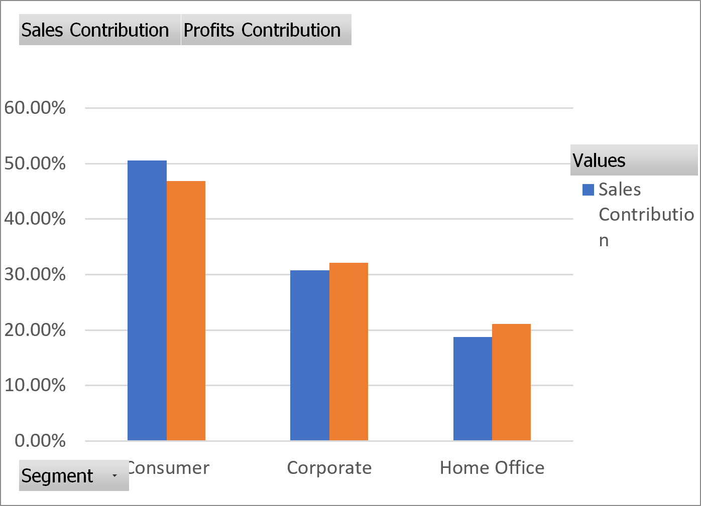
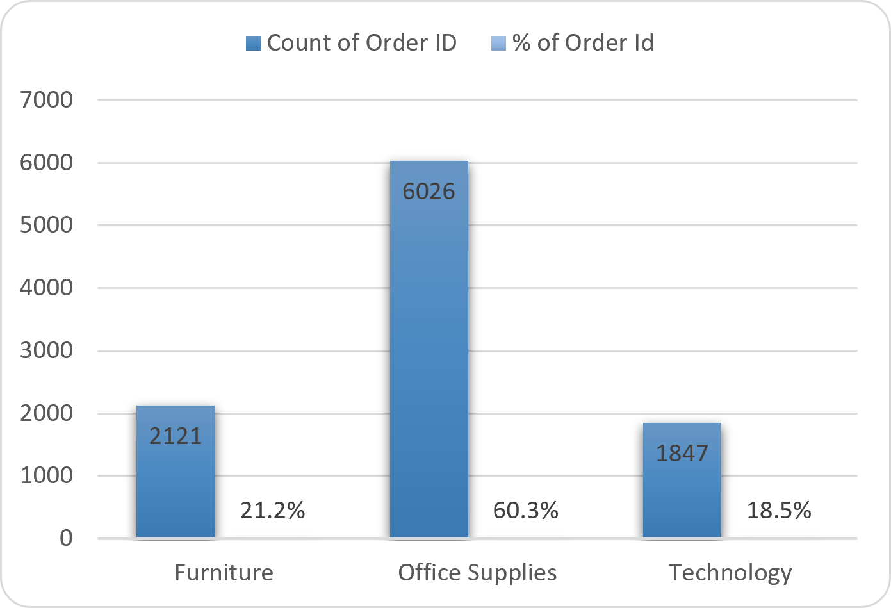
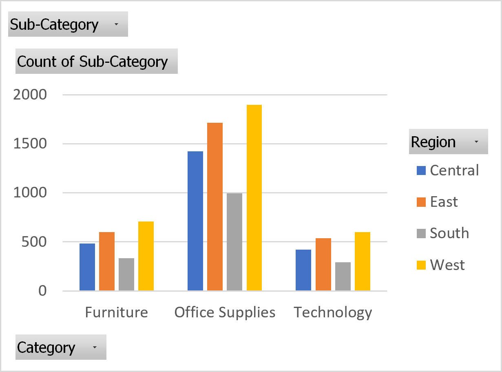
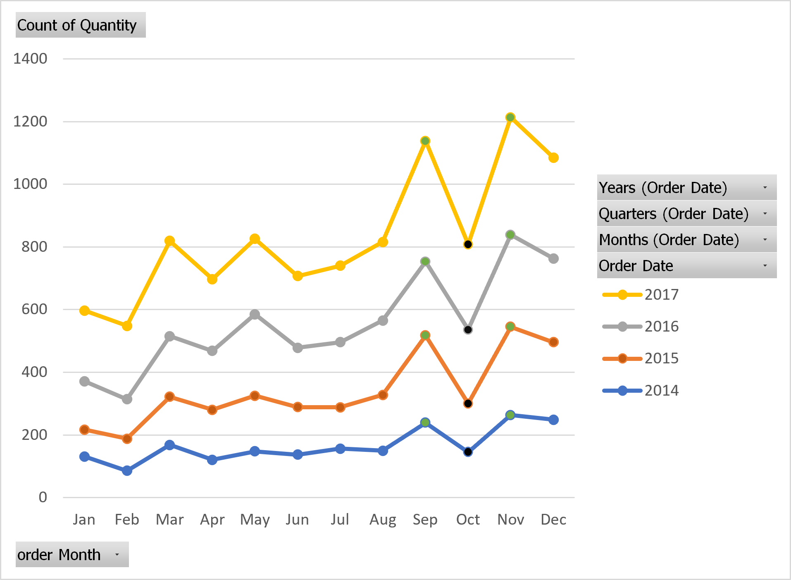
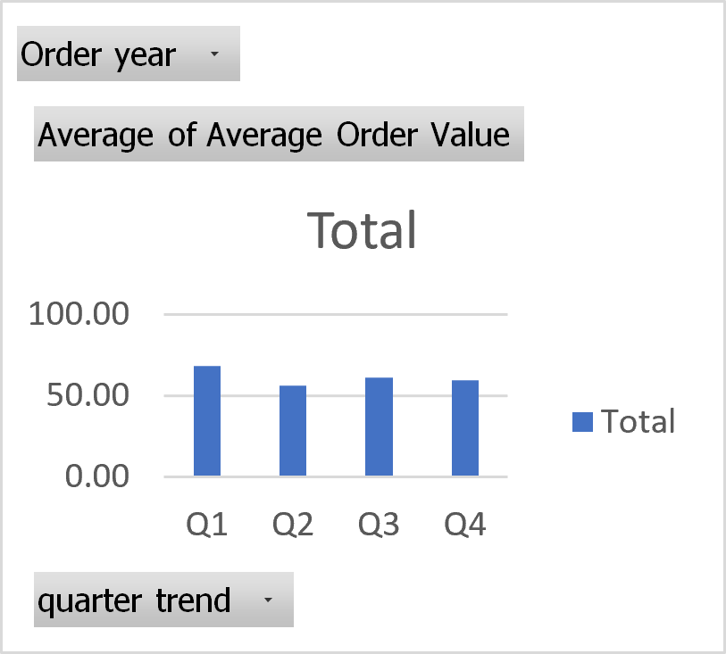
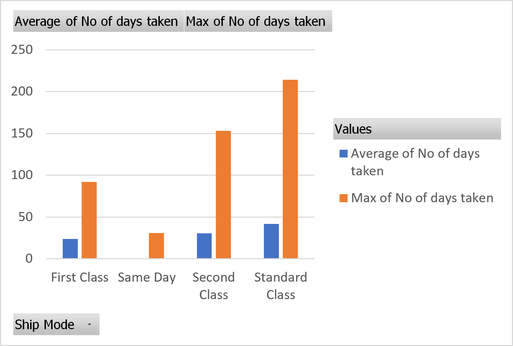

# Retail-Sales-Analytics
Retail sales analysis using Microsoft Excel to identify customer, product, profitability, and operational insights.
## 📌 Project Overview

Businesses generate thousands of sales transactions every year, but raw data alone cannot answer important business questions about customer behavior, product performance, profitability, and operational efficiency.

In this project, I analyzed transactional data from a North American retail store using Microsoft Excel to transform raw sales data into actionable business insights. The project involved data cleaning, transformation, exploratory data analysis (EDA), Pivot Tables, Pivot Charts, and business recommendations to support data-driven decision-making.

## 🎯 Business Objective

This project was conducted to answer key business questions, including:

- Which customer segments contribute the most to sales and profit?
- Which product categories generate the highest demand and profitability?
- How does performance vary across different regions?
- Are there seasonal trends in sales and order activity?
- What operational patterns can help improve business performance?

## 📊 Dataset Overview

| Attribute | Details |
|-----------|---------|
| Dataset | Retail Orders Dataset |
| Time Period | 2014–2017 |
| Total Orders | 9,994 |
| Product Categories | 3 |
| Regions | 4 |
| Original Columns | 23 |
| Final Columns | 29 |
| Tools Used | Microsoft Excel |

## 🔄 Project Workflow

```text
Raw Data
    ↓
Data Cleaning
    ↓
Data Transformation
    ↓
Exploratory Data Analysis (EDA)
    ↓
Business Insights
    ↓
Recommendations
```

## 🛠️ Tools & Skills Used

### Tools

- Microsoft Excel
- Pivot Tables
- Pivot Charts
- Conditional Formatting

### Skills Demonstrated

- Data Cleaning
- Data Transformation
- Exploratory Data Analysis (EDA)
- Business Analysis
- Trend Analysis
- Customer Segmentation
- Product Performance Analysis
- Business Reporting
- Data-Driven Decision Making

## 📈 Key Business Insights

### 1. Which Customer Segment Generates the Highest Profit?

**Finding**

The Consumer segment generated the highest sales and profit, making it the primary revenue contributor for the business.

**Business Impact**

Maintaining customer satisfaction and retention within this segment is essential for sustained business growth.

**Recommendation**

Prioritize marketing campaigns, loyalty programs, and customer engagement initiatives for Consumer customers while exploring opportunities to increase purchases from other segments.



### 2. Which Product Category Performs the Best?

**Finding**

The Technology category generated the highest profit despite having fewer orders than some other categories, indicating strong profit margins.

**Business Impact**

High-performing product categories contribute significantly to overall profitability and can drive sustainable business growth when strategically promoted.

**Recommendation**

Increase the visibility of Technology products through targeted marketing campaigns, bundled offers, and inventory planning while reviewing the profitability of lower-performing categories.



### 3. Which Region Performs the Best?

**Finding**

The West region recorded the highest order volume across all product categories, while product demand remained relatively consistent across regions.

**Business Impact**

Understanding the factors behind the West region's performance can help improve sales strategies in other regions.

**Recommendation**

Analyze successful sales practices in the West region and replicate them in lower-performing regions to improve overall business performance.



### 4. Are There Seasonal Trends in Sales?

**Finding**

Sales revenue increased toward the end of the year, with Q4 generating the highest revenue. September and November consistently recorded peak order activity.

**Business Impact**

Recognizing seasonal demand patterns enables better inventory planning, staffing, and promotional campaigns.

**Recommendation**

Prepare inventory, logistics, and marketing campaigns ahead of the Q4 sales season to effectively meet increased customer demand.



### 5. How Does Average Order Value Change Over Time?

**Finding**

Average Order Value remained relatively stable across quarters, with Q1 recording the highest average order value.

**Business Impact**

A stable Average Order Value indicates consistent customer purchasing behavior while highlighting opportunities to increase revenue per transaction.

**Recommendation**

Investigate purchasing patterns during Q1 and identify strategies such as product bundles or cross-selling to increase order value throughout the year.



### 6. What Operational Improvements Can Be Made?

**Finding**

Standard Class experienced the longest average fulfillment time. Binders showed high order volume and return activity, while shipping mode had minimal impact on sales and profit.

**Business Impact**

Reducing fulfillment delays and investigating product returns can improve customer satisfaction and operational efficiency.

**Recommendation**

Review fulfillment processes for Standard Class shipments and analyze the root causes of high return rates to improve operational performance.


